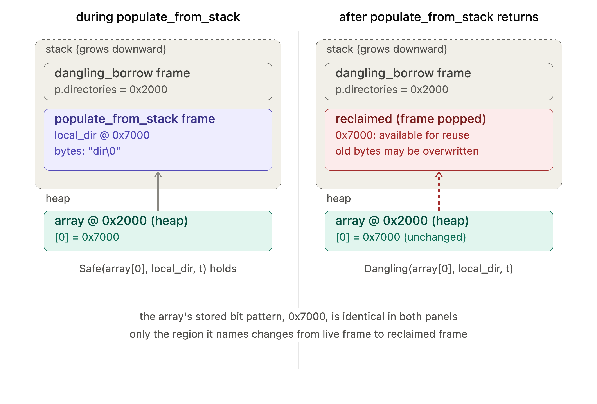

The heap array in both panels is drawn identically on purpose — `[0] = 0x7000` never changes. What flips between the two states is entirely on the stack side: the inner frame goes from a solid, valid region to a hatched "reclaimed" region once `populate_from_stack` returns. That's the whole bug in one picture — the pointer's *value* is static evidence of nothing; the danger is a fact about the *target region's* current status, which lives in neither `p` nor the array, only in the (informal, unenforced) convention of "who currently owns this stack slot."

Exactly — you've isolated the actual causal mechanism, and it's worth stating precisely why `strcpy` is a red herring here.

**`strcpy` is irrelevant to the bug.** It's just how `local_dir` gets populated with bytes — swap it for a literal assignment, `sprintf`, `read()` into the buffer, anything — the danger is identical regardless of *how* `local_dir` gets its contents. `strcpy` was never the load-bearing operation.

**What's actually load-bearing is the temporal sandwich you just named.** Write it as a sequence of events in $\mathbf{T}$:

$$
\underbrace{\text{birth}(\texttt{local\_dir})}_{e_1} \;<\; \underbrace{\texttt{p.directories[0]} \leftarrow \&\texttt{local\_dir}}_{e_2} \;<\; \underbrace{\text{death}(\texttt{local\_dir})}_{e_3} \;<\; \underbrace{\text{read }\texttt{p.directories[0]}}_{e_4}
$$

The bug is entirely the fact that $e_3$ — `populate_from_stack`'s frame popping — sits **between** $e_2$ (the write that establishes the borrow) and $e_4$ (the read that uses it). If there were no intermediate function at all — if `local_dir` and the read both lived in `dangling_borrow`'s own frame — $e_3$ simply wouldn't exist as an event separating $e_2$ from $e_4$, because `local_dir`'s frame and the use-site's frame would be the *same* frame, alive continuously across both. The nesting-and-return of a call is precisely what inserts a possible death event into the middle of an otherwise-safe-looking write/read pair.

This is also exactly why the earlier laminarity fact matters as more than trivia: **a borrow written and read entirely within one frame's lifetime is automatically safe** (nothing can die in between, since nothing else's death is scheduled inside that span), but the instant a borrow crosses a call boundary — written inside a callee, intended to be read after that callee returns — you've introduced exactly one guaranteed death event (that callee's frame ending) sitting in the danger zone. The general rule this generalizes to: **any borrow that needs to survive past the return of the function that created it cannot come from that function's own locals** — it must come from something whose lifetime already exceeds the caller's need, i.e. the heap, or storage the caller itself owns and passed in. That's the entire justification for why `set_first_dir`'s fix is "copy with `strdup`" rather than "just be more careful about when you read it" — no amount of careful sequencing rescues a borrow whose source has already been scheduled to die by the language's own call/return mechanics.
