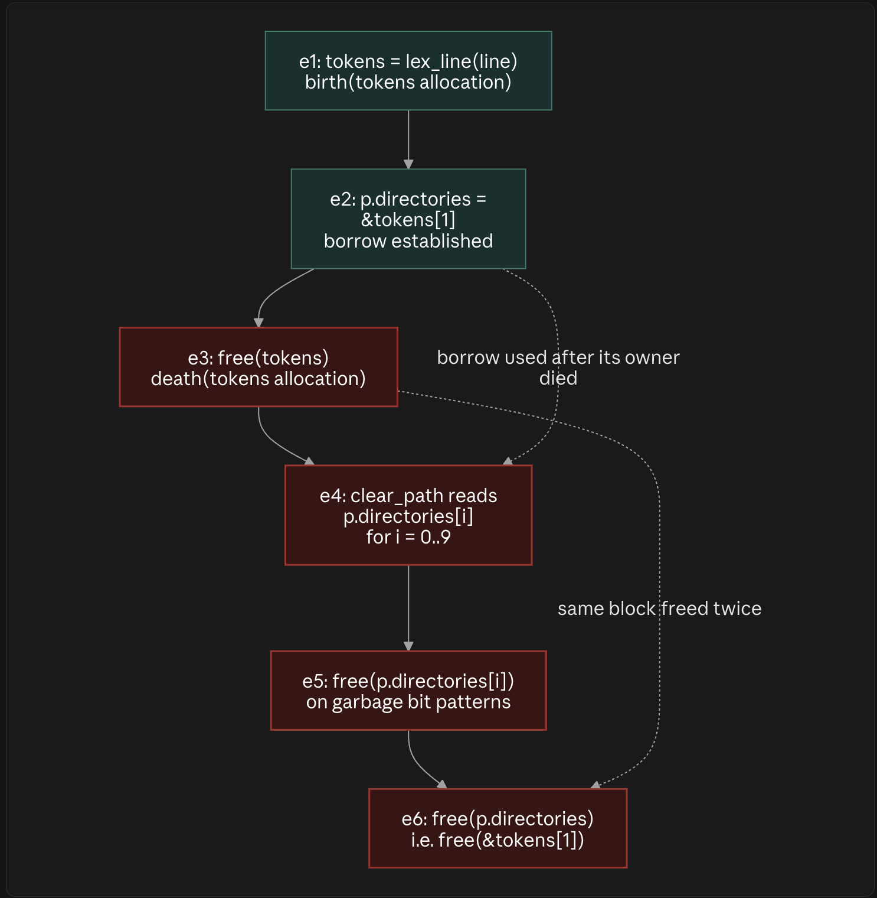

Reading the two dashed cross-links as the two named bugs:

**`e2 ⇢ e4` — the borrow-outliving-owner problem.** The solid chain says these events happen in this fixed order regardless of anything else: $e_2 < e_3 < e_4$. `e2` establishes a borrow into `tokens`'s allocation; `e3` ends that allocation's lifetime; `e4` then reads through the borrow anyway. This is exactly $t \notin L(a)$ from the earlier formalization — the *ordering itself* is the bug, not any single event in isolation. Note `e4` is also downstream of the wrong `count = 10`, so even setting aside dangling entirely, it's walking past where valid data ever existed.

**`e3 ⇢ e6` — the double free.** Two separate calls, `free(tokens)` and `free(p.directories)`, target addresses that denote **the same underlying heap block** (`p.directories` *is* `&tokens[1]`, an alias into that block, not a second allocation). The allocator's bookkeeping for that block gets torn down once at `e3`; `e6` hands the same address back to `free` a second time, which is the double-free proper — undefined behavior on the allocator's internal metadata, distinct from `e4`/`e5`'s use-after-free reads.

The causal point the diagram is making: these are **two different violations of the same invariant** ($t \in L(a)$) triggered by **one root cause** — `handle_path_broken` never copying, only aliasing. Fixing the aliasing (borrowing → owning, via the `strdup`-based `handle_path` from earlier) removes both dashed edges simultaneously, because both `e4` and `e6` stop referencing `tokens`'s block at all once `p.directories` points at its own independently-owned allocation.