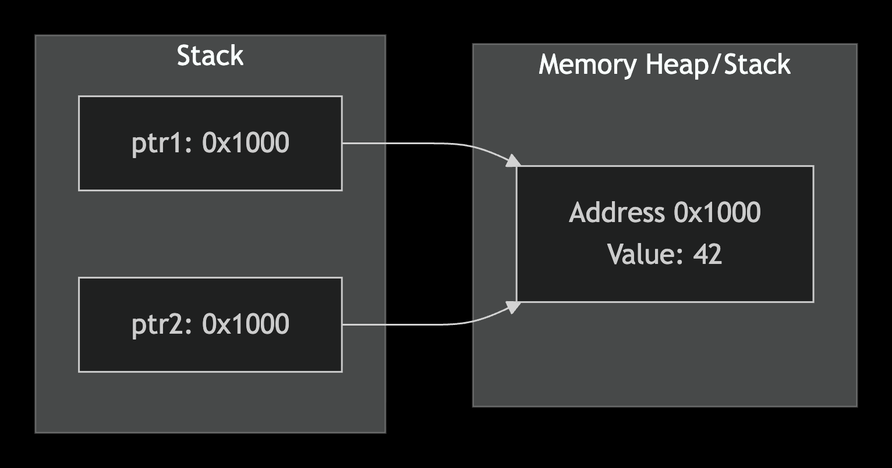

Broadly yes — your three-part structure is right, but let me tighten each clause against the formal version, because a couple of phrasings are doing more informal work than they should.

**"Making each assignment or potential assignment of p disjoint in lifetimes"** — close, but the load-bearing word should be *allocations*, not *lifetimes* directly. What you actually need is $\mathrm{addr}(b_i) \cap \mathrm{addr}(a_{\text{tokens}}) = \varnothing$ — disjoint address ranges, guaranteed automatically the instant `strdup`/`malloc` hands you a fresh block (that's the allocator invariant, not something you engineer per-assignment). Disjoint *lifetimes* would mean their time-intervals don't overlap, which is a different and weaker property — two allocations can have wildly overlapping lifetimes and still be perfectly safe, as long as their address ranges don't collide. It's the addresses that must be disjoint; the lifetimes are free to overlap however they like (and in fact `p.directories[i]`'s lifetime *does* overlap `tokens`'s lifetime for a while in the fixed version — both are alive simultaneously right after `handle_path_fixed` runs, and that's fine).

**"Making tokens and p->directories also disjoint in memory storage so their freeing does not interact"** — yes, this is exactly $F(\texttt{free(tokens)}) \neq F(\texttt{free(p.directories)})$, correct as stated.

**"Their borrowing is just a read instead of two pointers one item"** — this is the one I'd restate rather than confirm outright, because "borrowing is just a read" undersells what happened: the fix didn't turn a *borrow* into a *read*, it eliminated the borrow relationship entirely by replacing it with a **copy**. What remains — `clear_path` reading `p.directories[i]` — was already "just a read" even in the *broken* version; reads aren't what makes something a borrow or not. A borrow is defined by the *aliasing relation* (does this pointer's value fall in someone else's address range), not by what operation you perform through it. So the precise statement is: before, you had one allocation ($a_{\text{tokens}}$) with two pointer-variables aliasing into it, one of which (`p.directories`) was a borrow of the other's owned region; after, you have two allocations, and `p.directories` no longer aliases `tokens` at all — it owns its own, disjoint region, and reads through it are safe not because they're "just reads" but because there's no longer anyone else's death event that can invalidate them.

So: right instinct on all three counts, but tighten "lifetimes" → "address ranges" in clause one, and "borrowing becomes a read" → "borrowing is replaced by independent ownership" in clause three. Those aren't nitpicks — they're the difference between describing the fix by its *symptom* (fewer things alias, fewer reads look dangerous) versus its *cause* (the allocator's disjointness invariant now applies where it previously didn't, because you stopped taking an address from inside someone else's block).

The axes are doing the conceptual work here: **time runs horizontally, address runs vertically**, so a live allocation is a rectangle — its width is its lifetime, its vertical position is which addresses it occupies.

Left panel: `p.directories`'s arrow lands *inside the same teal band* as `a_tokens` — there's no second rectangle at all, because nothing new was allocated. It's one object with two names pointing at it. The read at $t_4$ falls in a time-slice where that row of the address space has already been vacated (the band ends at $t_3$), so the red dot sits in empty space — dangling, exactly $t_4 \notin L(a_{\text{tokens}})$.

Right panel: `a_tokens`'s band is completely unchanged — same lifetime, same eventual death at $t_3$ — but `strdup` at $t_2$ opens a **second rectangle at a different vertical position** (`b_i`), which is the picture of "disjoint address range," not "same range, read later." The read at $t_4$ now lands inside `b_i`'s own band, which was never entangled with `a_tokens`'s row to begin with. That's the visual argument for your restated claim: nothing about the *operation* at $t_4$ changed between panels — it's a read in both. What changed is which rectangle it lands in, and whether that rectangle's death has any relationship to a completely different piece of memory dying on schedule at $t_3$.