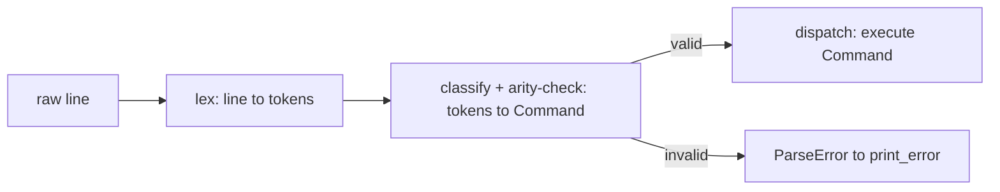

## A. Ordering parse vs. handle vs. arity-check

**The governing principle, stated first because it drives everything else:** *parse, don't validate.* This is the Jane-Street-articulated version of a discipline sel4 enforces at the proof level and Google's style guides enforce by convention — the idea is that validation should happen exactly once, at the boundary, and its *output* should be a data structure in which the invalid states are **unrepresentable**, not merely *unchecked*. Everything downstream of that boundary then gets to be a total, obviously-correct function, because there's nothing left for it to fail on.

Map this onto your shell as a **sum type** (coproduct) — this is where the category-theory framing actually earns its keep, not as decoration:

$$
\text{Command} \;\cong\; \text{Exit} \;+\; \text{Cd}(\Sigma^*) \;+\; \text{Path}(\Sigma^{*m}) \;+\; \text{External}(\Sigma^*, \Sigma^{*k}, \text{Redirect}?) \;+\; \text{ParseError}
$$

The $+$ here is a genuine coproduct: a value of type `Command` is *exactly one* of these variants, tagged, and — critically — each variant only carries the data that is *valid for that variant*. `Cd` carries exactly one string, not "a token array you still need to arity-check." `Exit` carries nothing. This is what "arity check baked into the type" means concretely in C, where you don't have real sum types: a `struct` with an `enum tag` plus a `union` (or, more simply for a project this size, just separate fields that you only populate for the matching tag), constructed by a **smart constructor** — a function whose only job is "given raw tokens, either produce a valid `Command` or produce `ParseError`, and there is no third outcome."

So the causal order is:



The reason **arity checking belongs inside step C, not step D**, is that step D should never be able to observe an arity violation — if `handle_chdir` is only ever called with a `Command.Cd` that the smart constructor already proved carries exactly one non-null string, `handle_chdir` doesn't need an `if (arg == NULL)` guard at all. That guard, if you write it there instead, is a symptom of validation leaking past the boundary where it belongs. This is the sel4-style argument for why you want the check *once*, at the earliest point, rather than defensively re-checked at every consumer — redundant checks aren't "extra safe," they're evidence the type doesn't actually rule out the bad case, which is worse for both correctness and readability.

Practically for your code: rename your current `parse_handle_single_command` split into two real functions —

- `classify_command(char **tokens) -> Command` — does *all* arity/shape validation, returns the tagged struct. This subsumes what your `if/else if` chain currently does, but stops at "recognize and validate," never calls `chdir()` or touches `SearchPath`.
- `execute_command(ShellState *shell, Command cmd) -> int` — a `switch` on the tag, each case a total, one-line dispatch to `handle_exit()`/`handle_chdir()`/`handle_path()`/`handle_external()`, none of which re-check shape.

This also directly fixes your **blank-line-crashes-on-`tokens[0]`** bug from earlier: `classify_command` is the one place that needs to check `tokens[0] == NULL` and return `ParseError`, and every other function is thereby freed from ever worrying about it.

---

## B. Token lifetime — the ownership discipline

State the aliasing fact precisely, because it's the entire source of confusion: `strsep()` does **not** copy substrings — it writes a `\0` into the original `line` buffer at each delimiter and returns pointers *into that same buffer*. So `tokens[i]` are **borrowed** pointers into `line`'s storage; they own nothing. `tokens` (the `char**` array itself) is the only thing `lex_line` actually allocates, and it is the only thing that needs `free()`ing after use.

This gives you exactly two lifetimes, nested:

$$
\text{lifetime}(\texttt{tokens array}) \;\subset\; \text{lifetime}(\texttt{line buffer})
$$

`line`'s lifetime spans one `getline()` call to the next `getline()` call (since you reuse the same pointer across iterations, `getline` may realloc it, but conceptually it's "alive" for one full loop iteration until overwritten). `tokens`'s lifetime should span exactly **one call to `handle_line`** — created at the top, consumed by `classify_command`/`execute_command`, freed before `handle_line` returns. Concretely:

```
handle_line(shell, line):
    tokens = lex_line(line)        // allocates the array only
    cmd = classify_command(tokens)  // borrows tokens[i] into cmd where needed
    result = execute_command(shell, cmd)
    free(tokens)                    // free the array — never the strings inside it
    return result
```

Note the asymmetry with `handle_path`: because `Path` needs its argument strings to **outlive** this call (they get stored in `shell->path` for use by every future line), that's precisely the one place you must `strdup()` — copying out of borrowed storage into owned storage before the borrow's lifetime ends. Everywhere else (`Cd`'s argument, `External`'s argv for `execv`), the tokens can be used *while still borrowed*, because `execv`/`chdir` consume the string synchronously, within the same lifetime window — no copy needed. This is the same discipline your Rust preference already encodes (borrow-or-mutate, never gratuitously own): **only copy at the exact point where something needs to survive past the borrow's scope, and nowhere else.**

---

## Critique of this version (document 3)

### Won't compile
- `clear_path`: parameter is named `path`, but the body uses `p->directories[i]`, `p->directories`, `p->directory_count` — `p` is undefined. (Also missing semicolon after the `free(p->directories[i])` line.)
- `handle_path`: called as `handle_path(shell, &tokens[1], path_argc)` — three arguments — but defined as `int handle_path(SearchPath *path, char **args)` — two parameters. Also `shell` (a `ShellState*`) is being passed where a `SearchPath*` is expected — wrong type even setting arity aside. `path_argc` is never declared anywhere in `parse_handle_single_command`.
- `handle_path`'s body is missing a closing `}` for the copy loop, and the function itself never closes properly relative to `return 0;` — as written this won't parse.

### Compiles-but-wrong (once the above is fixed)
- **Off-by-one in `handle_path`'s counting loop**: `for (size_t i = 1; args[i] != NULL; ++i) argc++;` starts at index `1`, but `args` is already `&tokens[1]` from the call site — meaning `args[0]` *is* the first real path argument, and this loop skips it and starts counting from the *second* argument. Then the copy loop starts at `i = 0`. These two loops disagree on where the data starts — you'll undercount by one and likely copy a `NULL`-adjacent or garbage entry. Pick one indexing convention and use it consistently in both loops — the cleanest fix is to always treat `args[0]` as the first argument once you've already offset the pointer at the call site.
- **`handle_path` doesn't null-terminate `directories`.** You track `directory_count` separately, which is a valid convention — but only if *every* consumer of `SearchPath` uses the count and never scans for a `NULL` sentinel. Make sure your (currently unwritten) resolution function commits to the count-based convention too, or you'll get a silent OOB read the first time someone iterates it the other way.
- **`main`, batch branch: `free(&line)`** — this frees the address of the local variable `line` itself (stack storage), not the heap buffer `line` points to. This is undefined behavior, not a no-op — should be `free(line)`, matching the (correct) interactive branch just below it.
- **The redundant outer `while (true)` in the interactive branch is still present**, unchanged from the prior version — it has no break condition of its own and adds nothing; the inner loop already does all the work. Worth deleting now while you're restructuring, since it also causes `clear_path`+`exit(0)` to only ever execute after the *inner* loop breaks, which happens to work here only because nothing can actually re-enter the outer loop.
- **`tokens` is still never freed anywhere** — per the lifetime discipline above, `handle_line` should free the array (not the strings) before returning, once per call. Right now every single line typed leaks one `malloc`'d array.
- **`classify`/arity guard for blank lines is still absent** — `parse_handle_single_command` dereferences `tokens[0]` with no null check, so an empty or whitespace-only line still segfaults. This is exactly the case Part A's `classify_command` boundary is meant to close off for good.

### Structural note (the good part)
The extraction into `handle_exit` / `handle_chdir` / `handle_path` as separate functions, and `clear_path` as an explicit deallocator, is the right shape and lines up with the parse/handle split in Part A — you're most of the way to a `classify_command`/`execute_command` split already; the main remaining move is pulling the `strcmp`/arity conditions out of `parse_handle_single_command` into a function that *returns a validated `Command` value* rather than directly branching into execution inline.