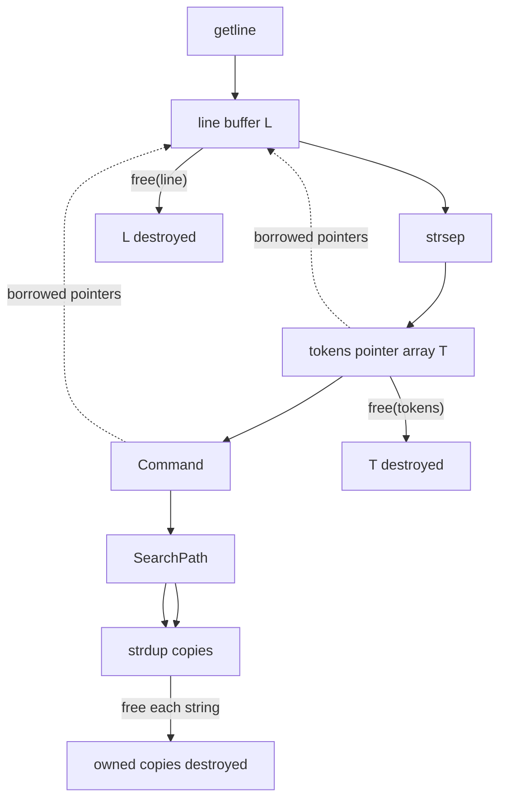

**Intent: ownership/lifetime formalization.** The key question is: **why is `path` deep-freed, while `tokens` is only shallow-freed?**

The short answer is:

> `tokens` is an **owning container over borrowed strings**.
> `SearchPath` is an **owning container over owned strings**.

That distinction comes directly from **where the bytes came from and who is responsible for their lifetime**.

---

# 1. First, model the memory objects

For an input such as:

```text
path /bin /usr/bin
```

`getline()` gives you one mutable line buffer:

$$
L = \texttt{"path /bin /usr/bin\textbackslash n\textbackslash 0"}
$$

Then `lex_line(&line)` uses `strsep()`.

Crucially, `strsep()` **does not allocate new strings**.

It transforms the existing buffer:

```text
L:
[path][ ][/bin][ ][/usr/bin][\n][\0]
```

into something conceptually like:

```text
tokens
  |
  +----> "path\0"
  |
  +----> "/bin\0"
  |
  +----> "/usr/bin\0"
```

The strings are still **inside `line`**.

So the ownership relation is:

$$
\operatorname{owner}(\text{strings}) = \texttt{line}
$$

while:

$$
\operatorname{owner}(\texttt{tokens}) = \texttt{lex\_line}
$$

More formally, if:

$$
L = \text{line buffer}
$$

and

$$
T = (\&L_0,\&L_1,\ldots,\&L_n)
$$

then:

$$
T : \text{container of pointers}
$$

but:

$$
L : \text{owner of pointed-to character storage}
$$

Therefore:

```c
free(tokens);
```

is correct.

But:

```c
free(tokens[0]);
```

would be incorrect, because `tokens[0]` points **into `line`**, not to an independently allocated object.

---

# 2. Your `tokens` structure is therefore

Think of the type as approximately:

$$
T = \operatorname{Vec}(\operatorname{BorrowedString}(L))
$$

The important distinction is:

$$
\operatorname{Vec}(\text{borrowed } char^*)
$$

not:

$$
\operatorname{Vec}(\text{owned } char^*)
$$

Your function:

```c
char **lex_line(char **line)
```

allocates the **pointer array**:

```c
char **tokens = malloc(...);
```

but does not allocate the strings.

So there are two different allocations:

$$
\boxed{
\texttt{tokens} \rightarrow \text{allocated}
}
$$

$$
\boxed{
\texttt{tokens[i]} \rightarrow \text{borrowed from line}
}
$$

That gives:

```text
             owns
handle_line ───────► tokens
                       │
                       │ points into
                       ▼
                     line
                       │
                       ├── "path"
                       ├── "/bin"
                       └── "/usr/bin"
```

Hence cleanup:

```c
free(tokens);
```

and eventually:

```c
free(line);
```

---

# 3. Now compare `SearchPath`

This is fundamentally different.

Your `path` command receives:

```text
tokens
   │
   ├── "path"
   ├── "/bin"
   └── "/usr/bin"
```

Initially those strings are still owned by `line`.

But then you do:

```c
path->directories[i] = strdup(args[i]);
```

`strdup()` **allocates a new character array and copies the bytes**.

So now:

```text
line
 │
 ├── "path"
 ├── "/bin"
 └── "/usr/bin"


SearchPath
 │
 ├── strdup("/bin")      ──► NEW allocation
 └── strdup("/usr/bin")  ──► NEW allocation
```

You have created a new ownership domain.

Formally:

$$
P_i = \operatorname{copy}(T_i)
$$

and therefore:

$$
P_i \not\subseteq L
$$

Instead:

$$
\operatorname{owner}(P_i) = \texttt{SearchPath}
$$

So your `SearchPath` is:

$$
P =
\operatorname{Array}
\left(
\operatorname{OwnedString},
\ldots,
\operatorname{OwnedString}
\right)
$$

That is why this is correct:

```c
for (size_t i = 0; i < path->directory_count; i++) {
    free(path->directories[i]);
}

free(path->directories);
```

You're destroying **both layers of ownership**:

$$
\boxed{
\text{SearchPath}
\rightarrow
\text{array}
\rightarrow
\text{strings}
}
$$

---

# 4. The entire lifetime can be formalized

Suppose the command is:

```text
path /bin /usr/bin
```

The lifecycle is:



There are therefore **three distinct storage layers**:

$$
\boxed{
L
\quad
T
\quad
P
}
$$

where:

* $L$ = line's character storage
* $T$ = lexer's pointer-array storage
* $P$ = persistent shell search-path storage

Their ownership relationships are:

$$
\operatorname{owner}(L)=\text{caller/main}
$$

$$
\operatorname{owner}(T)=\texttt{lex\_line}
$$

$$
\operatorname{owner}(P)=\texttt{SearchPath}
$$

---

# 5. Why does `Command` not own anything?

This is another important part of your design.

You explicitly designed:

```c
typedef struct {
    CommandTag tag;

    union {
        struct { char *dir; } cd;
        struct { char **dirs; size_t count; } path;
        struct { char *name; char **argv; } external;
    } as;
} Command;
```

Your comment says:

> borrowed strings

That's exactly right.

Your parse function:

```c
Command classify_command(char **tokens)
```

doesn't copy.

For example:

```c
cmd.as.external.name = tokens[0];
cmd.as.external.argv = tokens;
```

So:

$$
\texttt{Command}
\hookrightarrow
\texttt{tokens}
\hookrightarrow
\texttt{line}
$$

where $\hookrightarrow$ means **borrow/reference**, not ownership.

Therefore `Command` itself should not do:

```c
free(cmd.as.external.name);  // WRONG
free(cmd.as.external.argv);  // WRONG
```

because it doesn't own them.

Its lifetime is constrained by:

$$
\operatorname{lifetime}(\text{Command})
\leq
\operatorname{lifetime}(\text{tokens})
\leq
\operatorname{lifetime}(\text{line})
$$

And that's exactly what happens:

```c
Command cmd = classify_command(tokens);

execute_command(shell, &cmd);

free(tokens);
```

`cmd` disappears at the end of `handle_line`, while the strings remain valid until `tokens` and eventually `line` are destroyed.

---

# 6. The really important distinction: ephemeral vs persistent state

This is actually the architectural reason for your `strdup()`.

Your pipeline is:

$$
\text{line}
\rightarrow
\text{tokens}
\rightarrow
\text{Command}
\rightarrow
\text{execution}
$$

Those are **ephemeral representations**.

They exist only for processing one command.

But:

```text
path /bin /usr/bin
```

changes the shell's persistent state.

So you need:

$$
\text{ephemeral input}
\xrightarrow{\text{copy}}
\text{persistent state}
$$

Formally:

$$
\operatorname{parse} :
L \rightarrow Command(L)
$$

where `Command` contains borrowed references.

Then:

$$
\operatorname{execute}_{path} :
Command(L) \times ShellState
\rightarrow
ShellState'
$$

and specifically:

$$
\operatorname{installPath} :
\operatorname{BorrowedStrings}(L)
\rightarrow
\operatorname{OwnedStrings}
$$

That transition is exactly what `strdup()` implements.

---

# 7. Why can't `SearchPath` simply retain the token pointers?

Suppose you changed:

```c
path->directories[i] = strdup(args[i]);
```

to:

```c
path->directories[i] = args[i];
```

Then you'd have:

```text
line
 │
 ├── path
 ├── /bin ◄──────── SearchPath
 └── /usr/bin ◄──── SearchPath
```

But then `handle_line()` returns:

```c
free(tokens);
```

and later the main loop reuses the same `line` buffer on the next `getline()`.

So the search path would contain pointers into storage whose lifetime is no longer appropriate.

You would have:

$$
\operatorname{lifetime}(P)
>
\operatorname{lifetime}(L)
$$

which violates the ownership invariant.

That is a **dangling reference**.

`strdup()` changes this to:

$$
\operatorname{lifetime}(P_i)
\geq
\operatorname{lifetime}(ShellState)
$$

which is what you need.

---

# 8. Your shell therefore has two different memory regimes

This is the cleanest way to think about it.

### Ephemeral command-processing memory

$$
L \rightarrow T \rightarrow Command
$$

Everything here is borrowed from the line.

```text
getline
   ↓
 line
   ↓
strsep
   ↓
 tokens
   ↓
 Command
   ↓
 execute
   ↓
 destroy temporary representation
```

No deep copy necessary.

---

### Persistent shell-state memory

```text
Command
   ↓
PATH command
   ↓
strdup()
   ↓
SearchPath
   ↓
stays alive across commands
```

Therefore:

$$
\boxed{
\text{temporary representation}
\neq
\text{persistent state}
}
$$

And **the ownership boundary is exactly where the data crosses from temporary to persistent state.**

---

# 9. One subtle bug in your current code

There is an important issue in:

```c
if (strcmp(tokens[0], "cd") == 0){
    if (tokens[1] == NULL || tokens[2] != NULL){
        cmd.tag = CMD_PARSE_ERROR;
        return cmd;
    }
}
```

You forgot to actually construct the `CD` command.

You need something like:

```c
if (strcmp(tokens[0], "cd") == 0) {
    if (tokens[1] == NULL || tokens[2] != NULL) {
        cmd.tag = CMD_PARSE_ERROR;
        return cmd;
    }

    cmd.tag = CMD_CD;
    cmd.as.cd.dir = tokens[1];
    return cmd;
}
```

Otherwise a valid:

```text
cd /tmp
```

falls through to:

```c
cmd.tag = CMD_EXTERNAL;
```

So your intended coproduct:

$$
Command =
Exit
+
Cd(String)
+
Path(String^*)
+
External(String, String^*)
+
ParseError
$$

is not currently implemented completely.

---

# 10. One more ownership bug: `strdup()` failure

This:

```c
for (size_t i = 0; i < argc; i++) {
    path->directories[i] = strdup(args[i]);
}
```

can partially allocate and then fail.

For example:

$$
P = [\text{owned},\text{owned},\text{NULL},\ldots]
$$

if the third `strdup()` fails.

You should handle that transactionally:

```c
for (size_t i = 0; i < argc; i++) {
    path->directories[i] = strdup(args[i]);

    if (path->directories[i] == NULL) {
        for (size_t j = 0; j < i; j++) {
            free(path->directories[j]);
        }

        free(path->directories);
        path->directories = NULL;
        path->directory_count = 0;

        print_error();
        return 1;
    }
}
```

This preserves the invariant:

$$
\boxed{
directory\_count=n
\implies
\forall i<n,\ directories[i]\text{ is valid and owned}
}
$$

---

# 11. The set-theoretic picture

Your three representations can be thought of as sets of references.

Let:

$$
L = \{\text{character cells belonging to line}\}
$$

and:

$$
T = \{\text{pointers into }L\}
$$

Then:

$$
T \subseteq L^{\ast}
$$

where $L^\ast$ means finite sequences of references into $L$.

The persistent path is different:

$$
P = \{\text{newly allocated character arrays}\}
$$

with:

$$
P \cap L = \varnothing
$$

after `strdup()`.

So the important operation is:

$$
\operatorname{copy}: T \rightarrow P
$$

rather than merely:

$$
\operatorname{reference}: T \rightarrow T
$$

That's why `strdup()` isn't just an implementation detail—it is the **ownership conversion**:

$$
\boxed{
\text{borrowed string}
\xrightarrow{\texttt{strdup}}
\text{owned string}
}
$$

---

## The single rule to remember

For your shell, ask of every `char *`:

> **Does this pointer refer to memory allocated by this abstraction, or merely point into somebody else's buffer?**

Then:

| Object                      | Owns its `char*` strings? | Cleanup                             |
| --------------------------- | ------------------------- | ----------------------------------- |
| `line`                      | **Yes**                   | `free(line)`                        |
| `tokens`                    | **No**                    | `free(tokens)` only                 |
| `Command`                   | **No**                    | nothing                             |
| `SearchPath` after `strdup` | **Yes**                   | `free(each string)` + `free(array)` |

So the deepest principle is:

$$
\boxed{
\text{free according to ownership, not according to pointer depth}
}
$$

`char **` does **not** mean "deep free it."
It tells you the **shape of the reference**, not who owns the referenced objects.
