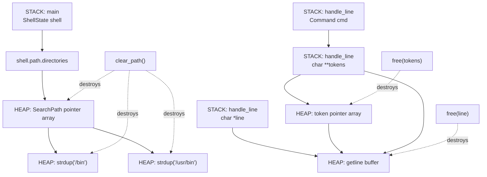

Yes. The most useful interpretation is to take **one concrete command** and follow the actual stack/heap objects through your pipeline.

**Intent: concrete memory-layout / ownership trace.**

Let's use:

```text
path /bin /usr/bin
```

## 1. At `main`

You have:

```c
ShellState shell;
init_shell(&shell);
```

Conceptually:

$$
\text{Stack}
\supset
\{\texttt{shell}\}
$$

and initially:

```text
STACK
┌─────────────────────────────┐
│ main()                      │
│                             │
│ shell                       │
│ ┌─────────────────────────┐ │
│ │ path                    │ │
│ │   directories ──────────┼─┼──► NULL
│ │   directory_count = 0   │ │
│ └─────────────────────────┘ │
└─────────────────────────────┘

HEAP
┌─────────────────────────────┐
│ empty                       │
└─────────────────────────────┘
```

`ShellState` itself is a local variable, so **the struct is on the stack**.

But that doesn't mean its future contents have to be on the stack.

The pointer:

```c
shell.path.directories
```

will point somewhere else.

---

# 2. `getline()` allocates the line buffer

You have:

```c
char *line = NULL;
size_t len = 0;

getline(&line, &len, stdin);
```

After reading:

```text
path /bin /usr/bin
```

you conceptually have:

```text
STACK
┌─────────────────────────────┐
│ main()                      │
│                             │
│ shell                       │
│   path                      │
│     directories ───────┐    │
│     count = 0          │    │
│                        │    │
│ line ──────────────────┼────┼──────┐
│ len                    │    │      │
└────────────────────────┘    │      │
                              │      ▼
HEAP                          │   ┌─────────────────────────┐
                              │   │ "path /bin /usr/bin\n\0"│
                              │   └─────────────────────────┘
                              │
                              └── pointer to heap allocation
```

So:

```c
line
```

is a **stack variable containing a pointer**.

The character data is in the **heap**.

This distinction is fundamental:

$$
\texttt{char *line}
\neq
\text{"string stored on stack"}
$$

It means:

$$
\texttt{line} \in \text{Stack}
$$

but:

$$
*\texttt{line} \in \text{Heap}
$$

---

# 3. `lex_line()` creates another heap allocation

Inside:

```c
char **tokens = malloc(bufsize * sizeof(char *));
```

you create the pointer array.

So now:

```text
STACK
┌───────────────────────────────────┐
│ handle_line()                     │
│                                   │
│ line ────────────────────────┐    │
│ tokens ─────────────────┐    │    │
└──────────────────────────┼────┼────┘
                           │    │
HEAP                       │    │
                           │    ▼
                           │  ┌──────────────────────────────┐
                           │  │ "path /bin /usr/bin\n\0"     │
                           │  └──────────────────────────────┘
                           │
                           ▼
                     ┌───────────────┐
                     │ tokens array  │
                     ├───────────────┤
                     │ [0] ──────────┼──────► "path"
                     │ [1] ──────────┼──────► "/bin"
                     │ [2] ──────────┼──────► "/usr/bin"
                     │ [3] = NULL    │
                     └───────────────┘
```

Notice the crucial thing:

### `tokens` owns the array

but

### `tokens[i]` does NOT own the strings.

`strsep()` modifies the existing `line` buffer by inserting `'\0'` characters.

Conceptually:

```text
line heap:

┌──────┬────┬──────┬────┬────────┬────┬────┐
│ path │ \0 │ /bin │ \0 │ /usr/bin│ \n │ \0 │
└──────┴────┴──────┴────┴────────┴────┴────┘
   ▲           ▲              ▲
   │           │              │
 tokens[0]  tokens[1]      tokens[2]
```

Therefore:

$$
\texttt{tokens[i]} \rightarrow \text{inside line}
$$

---

# 4. `Command cmd` is on the stack too

Then:

```c
Command cmd = classify_command(tokens);
```

creates another stack object.

For:

```text
path /bin /usr/bin
```

you get approximately:

```text
STACK
┌──────────────────────────────────────┐
│ handle_line()                        │
│                                      │
│ line ────────────────────────────┐   │
│ tokens ───────────────────────┐  │   │
│ cmd                            │  │   │
│ ┌────────────────────────────┐ │  │   │
│ │ tag = CMD_PATH             │ │  │   │
│ │ as.path.dirs ──────────────┼─┼──┼───┐
│ │ as.path.count = 2          │ │  │   │
│ └────────────────────────────┘ │  │   │
└─────────────────────────────────┼──┼───┘
                                  │  │
HEAP                              │  │
                                  │  ▼
                       tokens ──► pointer array
                                  │
                                  ▼
                       line ───► character buffer
```

Your:

```c
cmd.as.path.dirs = &tokens[1];
```

does **not copy `/bin` or `/usr/bin`**.

It creates:

$$
\texttt{Command}
\rightarrow
\texttt{tokens[1]}
\rightarrow
\texttt{line}
$$

So `Command` is just a temporary **view** over the input.

---

# 5. Now the important transition: `strdup`

Execution reaches:

```c
handle_path(&shell->path, cmd.as.path.dirs);
```

Then:

```c
path->directories[i] = strdup(args[i]);
```

This is where ownership changes.

For `/bin`:

```c
strdup("/bin")
```

creates a **new heap allocation**.

So now:

```text
STACK
┌──────────────────────────────────────┐
│ main()                               │
│                                      │
│ shell                                │
│ ┌──────────────────────────────────┐ │
│ │ path                             │ │
│ │                                  │ │
│ │ directories ─────────────────────┼─┼──────┐
│ │ count = 2                        │ │      │
│ └──────────────────────────────────┘ │      │
└──────────────────────────────────────┘      │
                                              ▼
HEAP
                         SearchPath allocation
                         ┌────────────────────┐
                         │ pointer[0] ─────────┼──────┐
                         │ pointer[1] ─────────┼───┐  │
                         └────────────────────┘   │  │
                                                  │  │
                                                  ▼  ▼
                                             ┌──────┐ ┌──────────┐
                                             │/bin\0│ │/usr/bin\0│
                                             └──────┘ └──────────┘

                         temporary input
                         ┌───────────────────────────────┐
                         │ path\0/bin\0/usr/bin\0...\0  │
                         └───────────────────────────────┘
```

Now there are **two copies of the strings**.

The first belongs to `line`.

The second belongs to `SearchPath`.

Formally:

$$
\texttt{line}
\owns
\{\texttt{"path"},\texttt{"/bin"},\texttt{"/usr/bin"}\}
$$

and:

$$
\texttt{SearchPath}
\owns
\{\texttt{"/bin"},\texttt{"/usr/bin"}\}
$$

---

# 6. Why `free(tokens)` is only one free

At the end:

```c
free(tokens);
```

you destroy:

```text
HEAP

tokens allocation
┌──────────┬──────────┬──────────┬─────────┐
│ pointer  │ pointer  │ pointer  │ NULL    │
└──────────┴──────────┴──────────┴─────────┘
     │          │          │
     └──────────┼──────────┘
                │
                ▼
        line's character data
```

You only free the **pointer array**.

Why?

Because:

$$
\texttt{tokens[i]} \not\owns \text{the character data}
$$

The character data belongs to:

```c
line
```

So later:

```c
free(line);
```

destroys it.

---

# 7. Why `clear_path()` needs two levels of `free`

Your `SearchPath` is different:

```c
typedef struct {
    char **directories;
    size_t directory_count;
} SearchPath;
```

After `strdup`, its structure is:

```text
STACK
shell.path.directories
        │
        ▼
HEAP
┌──────────────────────────┐
│ char* │ char*            │  ← array itself
└───┬──────┬───────────────┘
    │      │
    ▼      ▼
  HEAP    HEAP
┌──────┐ ┌───────────┐
│/bin\0│ │/usr/bin\0 │
└──────┘ └───────────┘
```

Therefore there are **three allocations**:

$$
A_0 = \text{pointer array}
$$

$$
A_1 = \texttt{strdup("/bin")}
$$

$$
A_2 = \texttt{strdup("/usr/bin")}
$$

You must release all three:

```c
free(A_1);
free(A_2);
free(A_0);
```

which is exactly:

```c
for (size_t i = 0; i < path->directory_count; i++) {
    free(path->directories[i]);
}

free(path->directories);
```

---

# 8. The complete picture

For one command:

```text
path /bin /usr/bin
```

the runtime memory relationship is essentially:



The key ownership graph is:

$$
\boxed{
\begin{aligned}
\texttt{shell.path}
&\owns
\texttt{directories}\\
\texttt{directories}
&\owns
\texttt{directories[i]}\\
\texttt{line}
&\owns
\text{character data}\\
\texttt{tokens}
&\owns
\text{pointer array only}\\
\texttt{Command}
&\owns
\text{nothing}
\end{aligned}
}
$$

---

# 9. The C pointer-depth misconception to avoid

This is especially important given your earlier questions about `*` and `**`.

`char **` does **not** imply:

> "there are two heap things, so I need two frees."

Instead:

```c
char **p;
```

means:

$$
p : \text{pointer}(\text{pointer}(\texttt{char}))
$$

It says **nothing about ownership**.

You could have:

```text
char **
   │
   ▼
stack pointer array
   │
   ├──► stack string
   └──► static string
```

or:

```text
char **
   │
   ▼
heap pointer array
   │
   ├──► heap string
   └──► heap string
```

or your `tokens` case:

```text
char **
   │
   ▼
heap pointer array
   │
   ├──► line buffer
   ├──► line buffer
   └──► line buffer
```

The **type describes reachability/shape**.

Ownership is a separate semantic invariant.

That is why the correct mental model is:

$$
\boxed{
\text{pointer depth}
\neq
\text{ownership depth}
}
$$

And your `strdup()` is precisely the operation that changes the latter:

$$
\boxed{
\text{borrowed pointer}
\overset{\texttt{strdup}}{\longrightarrow}
\text{owned allocation}
}
$$
