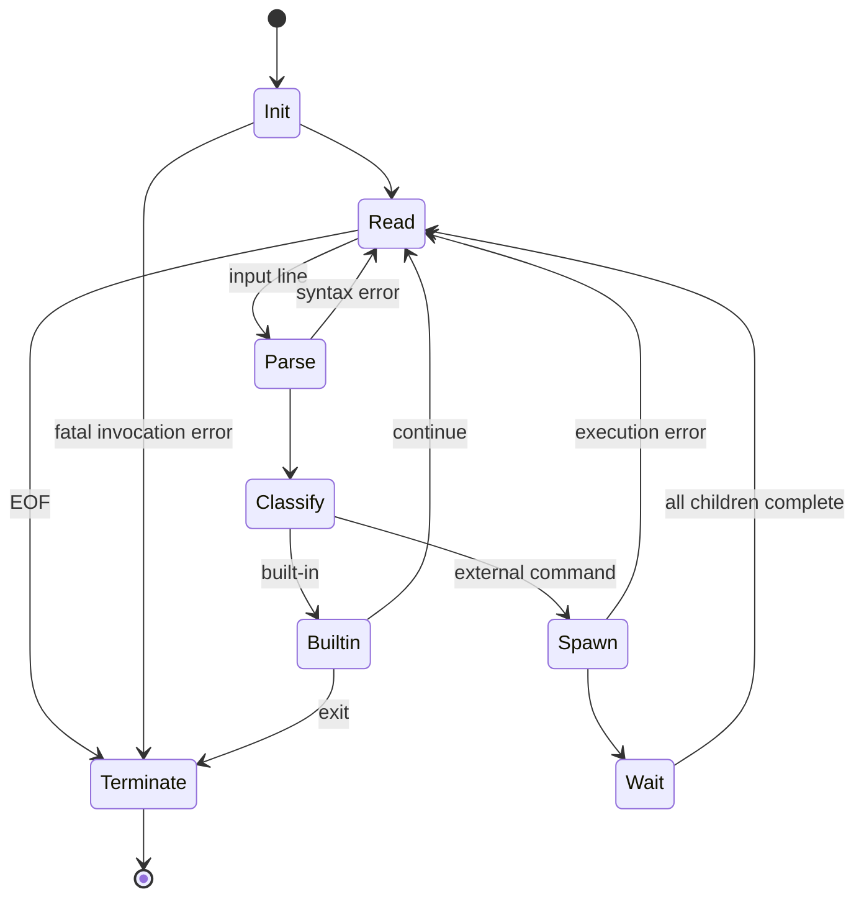
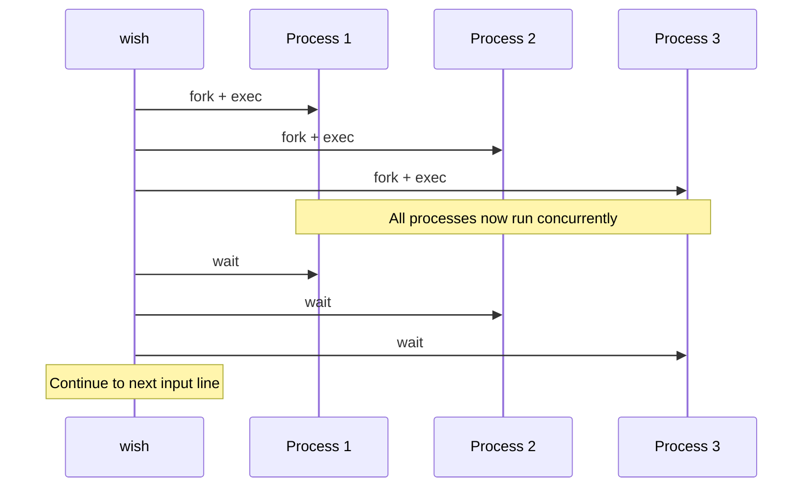

**Intent — formal specification / operational semantics:** you want the assignment turned from prose into a **linear, implementation-oriented specification**, with the states, transitions, invariants, and ordering constraints made explicit.

The core structure is:

$$
\text{Invocation}
\rightarrow
\text{Mode}
\rightarrow
\text{Input}
\rightarrow
\text{Lex/Parse}
\rightarrow
\text{Command Classification}
\rightarrow
\text{Execution}
\rightarrow
\text{Synchronization}
\rightarrow
\text{Next Input}
$$

The assignment explicitly defines `wish` as an input/execute loop, with `fork`/`execv`/`wait`, three built-ins, redirection, and parallel execution. 

# 1. Top-level specification

Let:

* $M = {\text{Interactive},\text{Batch}}$ be the execution modes.
* $P$ be the shell's current search path.
* $L$ be an input line.
* $C$ be a parsed command.
* $E$ be an execution plan.
* $S$ be the shell state.

Define:

$$
S = (M,P)
$$

The shell repeatedly applies:

$$
(S,L) \mapsto (S',E)
$$

and executes $E$.

The shell terminates when:

$$
L = \texttt{exit}
$$

or:

$$
L = \text{EOF}
$$

or an invocation-level fatal error occurs.

---

# 2. Invocation specification

The executable must be:

```text
wish
```

The valid invocation set is:

$$
Args \in \{\,[\,], [file]\,\}
$$

Therefore:

$$
|Args| > 1 \Rightarrow \text{fatal error} \Rightarrow exit(1)
$$

There are exactly two modes:

$$
mode =
\begin{cases}
Interactive & |Args| = 0\\
Batch & |Args| = 1
\end{cases}
$$

Initial path:

$$
P_0 = ["/bin"]
$$

This is explicitly specified by the assignment. 

---

# 3. Main state machine

The shell's control state can be formalized as:

$$
Q =
\{
Init,
Read,
Parse,
Classify,
Builtin,
Spawn,
Wait,
Terminate
\}
$$

with transitions:



The important conceptual distinction is:

$$
\boxed{\text{Parse error} \neq \text{program error} \neq \text{invocation error}}
$$

The shell handles the first; the executed program handles its own runtime arguments/errors; invocation errors can terminate the shell. 

---

# 4. Input semantics

Define the input source:

$$
I =
\begin{cases}
stdin & Interactive\\
file & Batch
\end{cases}
$$

For every iteration:

### Interactive

1. print:

```text
wish> 
```

2. call `getline()`
3. parse line
4. execute
5. repeat

### Batch

1. do **not** print prompt
2. call `getline()` from batch file
3. parse
4. execute
5. repeat

EOF in either mode:

$$
EOF \Rightarrow exit(0)
$$

The prompt distinction and EOF behavior are explicitly required. 

---

# 5. Lexical structure

The input language contains three major syntactic elements:

$$
Token =
Command \mid Argument \mid Operator
$$

Operators:

$$
Operator = \{>,\&\}
$$

Whitespace is:

$$
W = \{\text{space},\text{tab},\ldots\}
$$

Whitespace separates ordinary tokens but is **not required around operators**. Thus both:

```text
ls > output
```

and:

```text
ls>output
```

must be handled.

The assignment explicitly requires robustness to varying whitespace and states that operators do not require whitespace. 

---

# 6. Command algebra

A useful formalization is:

$$
Command =
Builtin(B)
\mid External(A)
$$

where:

$$
B \in
\{
Exit,
Cd,
Path
\}
$$

and an external command is an argument vector:

$$
A = [a_0,a_1,\ldots,a_n]
$$

where:

* $a_0$ = executable name
* $a_1,\ldots,a_n$ = arguments

For example:

```text
ls -la /tmp
```

becomes:

$$
["ls","-la","/tmp"]
$$

The shell must then resolve `ls` through its search path. 

---

# 7. Command classification

For every parsed command:

$$
classify(C) =
\begin{cases}
Builtin & C_0 \in \{exit,cd,path\}\\
External & otherwise
\end{cases}
$$

This classification matters because:

$$
Builtin \Rightarrow \text{execute in shell process}
$$

whereas:

$$
External \Rightarrow fork + execv
$$

The reason is state mutation. For example, `cd` must change the shell's own working directory, so spawning a child would not implement the desired semantics.

The assignment explicitly requires built-ins not to be executed like external programs. 

---

# 8. Path resolution

Let:

$$
P = [d_1,d_2,\ldots,d_n]
$$

be the current search path.

For executable name $x$, define:

$$
resolve(x,P)
=
\operatorname{first}
\{
d_i/x \mid access(d_i/x,X_OK)
\}
$$

Therefore:

$$
resolve("ls",["/bin","/usr/bin"])
=
"/bin/ls"
$$

assuming `/bin/ls` is executable.

If:

$$
\forall d_i \in P,\quad access(d_i/x,X_OK)=false
$$

then resolution fails and the shell emits the standard error.

The initial path is:

$$
P_0 = ["/bin"]
$$

The assignment explicitly says path lookup is the shell's responsibility and suggests `access(..., X_OK)` for this operation. 

---

# 9. Built-in semantics

## `exit`

Grammar:

$$
exit
$$

Valid:

$$
args(exit)=0
$$

Transition:

$$
exit() \Rightarrow Terminate
$$

Invalid:

$$
args(exit)\neq0
\Rightarrow Error
\Rightarrow Read
$$

The assignment specifically says arguments to `exit` are an error. 

---

## `cd`

Grammar:

$$
cd\;path
$$

Constraint:

$$
|args| = 1
$$

Semantics:

$$
chdir(path)
$$

If:

$$
chdir(path)=success
$$

then:

$$
S' = S
$$

except that the process's working-directory state has changed.

Otherwise:

$$
Error
$$

The command must execute in the shell process.

---

## `path`

Grammar:

$$
path\;d_1\;d_2\;\ldots\;d_n
$$

where:

$$
n \geq 0
$$

Semantics:

$$
P'=[d_1,d_2,\ldots,d_n]
$$

Critically:

$$
P' \neq P \cup [d_1,\ldots,d_n]
$$

It **replaces** the old path.

Therefore:

```text
path /bin /usr/bin
```

means:

$$
P := ["/bin","/usr/bin"]
$$

while:

```text
path
```

means:

$$
P := []
$$

and hence:

$$
P=[] \Rightarrow \text{no external command can be resolved}
$$

Built-ins remain executable because they do not depend on $P$. 

---

# 10. External execution

For:

$$
C = [x,a_1,\ldots,a_n]
$$

first compute:

$$
p = resolve(x,P)
$$

Then:

$$
fork()
$$

creates:

$$
Parent + Child
$$

Child:

$$
execv(p,C)
$$

Parent:

$$
waitpid(child)
$$

The fundamental process transformation is therefore:

$$
\boxed{
Command
\rightarrow
PathResolution
\rightarrow
fork
\rightarrow
execv
\rightarrow
wait
}
$$

`system()` is explicitly forbidden; `execv()` is required. 

---

# 11. Redirection

Extend the command algebra:

$$
Execution =
Command
\times
Redirection?
\times
ParallelContext
$$

Redirection syntax:

$$
C\;>\;f
$$

where:

$$
C = command + arguments
$$

and $f$ is exactly one filename.

The constraints are:

$$
\#(>) \leq 1
$$

and:

$$
\#(filename\ after\ >)=1
$$

Therefore:

```text
ls > output
```

is valid.

But:

```text
ls > output > other
```

is invalid.

And:

```text
ls > output other
```

is invalid because there are multiple tokens after `>`.

---

# 12. Redirection semantics

For an external process with redirection:

$$
stdout \mapsto f
$$

and unusually for this assignment:

$$
stderr \mapsto f
$$

So:

$$
stdout_{child}=f
$$

$$
stderr_{child}=f
$$

The file must be truncated if it already exists:

$$
open(f,O\_WRONLY|O\_CREAT|O\_TRUNC,\ldots)
$$

Then:

$$
dup2(fd,STDOUT\_FILENO)
$$

$$
dup2(fd,STDERR\_FILENO)
$$

Then:

$$
execv(...)
$$

Conceptually:

$$
\boxed{
fork
\rightarrow
open
\rightarrow
dup2(stdout)
\rightarrow
dup2(stderr)
\rightarrow
execv
}
$$

Redirection is therefore a **child-process environment transformation**, not a modification to the shell's own stdout/stderr. The assignment specifies that both standard output and standard error go to the same file. 

---

# 13. Parallel command algebra

The `&` operator partitions a line into commands:

$$
L = C_1 \& C_2 \& \cdots \& C_n
$$

with:

$$
n \geq 1
$$

The crucial semantic requirement is:

$$
spawn(C_1);
spawn(C_2);
\ldots;
spawn(C_n);
$$

**before any waiting occurs.**

Thus:

$$
\boxed{
spawn^n
\rightarrow
wait^n
}
$$

not:

$$
spawn(C_1)
\rightarrow
wait(C_1)
\rightarrow
spawn(C_2)
$$

The required execution model is:



This is one of the most important ordering invariants in the assignment. 

---

# 14. Unified execution model

You can therefore define an execution plan:

$$
E =
Sequential([C])
\mid
Parallel([C_1,\ldots,C_n])
$$

Each command can additionally contain:

$$
C = (argv, redirection?)
$$

So:

$$
E =
Sequential([C])
\mid
Parallel([C_1,\ldots,C_n])
$$

where:

$$
C_i=(argv_i,r_i?)
$$

Then execution becomes:

$$
execute(E)=
\begin{cases}
executeOne(C) & E=Sequential([C])\\
spawn(C_1);\ldots;spawn(C_n);waitAll & E=Parallel([...])
\end{cases}
$$

This gives you a very clean implementation boundary.

---

# 15. Error semantics

There is exactly one shell-level error output:

```text
An error has occurred
```

written to:

$$
STDERR
$$

using `write()`.

So define:

$$
error() = write(STDERR,\text{error\_message})
$$

Then shell-level errors have:

$$
error \Rightarrow print(error) \land continue
$$

except for fatal invocation errors:

$$
fatal \Rightarrow print(error) \land exit(1)
$$

The assignment explicitly distinguishes recoverable shell errors from invocation errors. 

---

# 16. Error classification

A useful implementation classification is:

$$
Error =
InvocationError
\mid
InputError
\mid
SyntaxError
\mid
BuiltinError
\mid
ResolutionError
\mid
SyscallError
$$

with:

| Error                         | Shell continues?        |
| ----------------------------- | ----------------------- |
| Too many invocation arguments | No                      |
| Bad batch file                | No                      |
| Invalid command syntax        | Yes                     |
| Invalid `exit` arguments      | Yes                     |
| Invalid `cd` arguments        | Yes                     |
| `chdir` failure               | Yes                     |
| `path` itself malformed       | Yes                     |
| Executable not found          | Yes                     |
| `fork` failure                | Yes                     |
| `execv` failure               | Yes                     |
| Program's own argument error  | Shell doesn't handle it |

The final distinction is important:

$$
ShellError \neq ChildProgramError
$$

If `ls` itself rejects `--whatever`, that is **not** a shell error. 

---

# 17. The complete linearized algorithm

This is the version I'd actually use as your implementation specification:

```text
1. Parse argv.

2. If argc is invalid:
       print error
       exit(1)

3. Determine mode:
       argc == 1 → interactive
       argc == 2 → batch

4. Initialize:
       path = ["/bin"]

5. Loop:

   5.1 If interactive:
           print "wish> "

   5.2 getline(input)

   5.3 If EOF:
           exit(0)

   5.4 Lex/parse input.

   5.5 If syntax invalid:
           print error
           continue

   5.6 Partition by '&'.

   5.7 For every resulting command:
           parse optional '> filename'

   5.8 If redirection syntax invalid:
           print error
           continue

   5.9 Classify commands:

           exit → builtin
           cd   → builtin
           path → builtin
           else → external

   5.10 If builtin:
           execute in shell process
           continue

   5.11 If external:

           For each command:
               resolve executable using path
               fork child
               child:
                   perform redirection if present
                   execv()
               parent:
                   record child PID

           IMPORTANT:
               do not wait yet.

   5.12 Wait for all spawned children.

   5.13 Return to step 5.
```

---

# 18. The key invariants

If you're implementing this as a systems exercise, these are the invariants I'd keep in your head rather than memorizing individual APIs.

### Invariant 1 — shell state belongs to the shell

$$
Builtin \Rightarrow \text{mutate ShellState}
$$

not a child.

### Invariant 2 — external programs belong to children

$$
External \Rightarrow fork \rightarrow execv
$$

### Invariant 3 — redirection belongs to the child

$$
Redirection \Rightarrow child\ FD\ transformation
$$

before `execv`.

### Invariant 4 — path is shell state

$$
path\ command \Rightarrow P_{t+1}=newPath
$$

### Invariant 5 — parallelism means spawn-before-wait

$$
\forall i<n:\ spawn(C_i)
$$

must occur before:

$$
wait(C_i)
$$

### Invariant 6 — one shell error representation

$$
\forall e\in ShellErrors:
\quad output(e)=
\text{"An error has occurred\n"}
$$

### Invariant 7 — shell errors don't become program errors

The shell validates **syntax and shell semantics**; the child program validates its own arguments.

---

# 19. A clean implementation decomposition

I would map the specification to something like:

```text
wish
├── main
│   ├── parse invocation
│   └── initialize Shell
│
├── Shell
│   ├── input mode
│   ├── search path
│   └── main loop
│
├── Parser
│   ├── tokenize
│   ├── parse commands
│   ├── parse &
│   └── parse >
│
├── Builtins
│   ├── exit
│   ├── cd
│   └── path
│
├── Resolver
│   └── search path → executable
│
├── Executor
│   ├── fork
│   ├── execv
│   ├── redirection
│   └── wait
│
└── Error
    └── canonical shell error
```

The deeper abstraction is:

$$
\boxed{
Input
\overset{parse}{\longrightarrow}
ExecutionPlan
\overset{execute}{\longrightarrow}
ProcessEffects
}
$$

That separation is especially useful here because **parsing determines the execution plan, while the executor determines process behavior**. The assignment itself suggests implementing functionality incrementally—single command, built-ins, redirection, then parallelism. 
