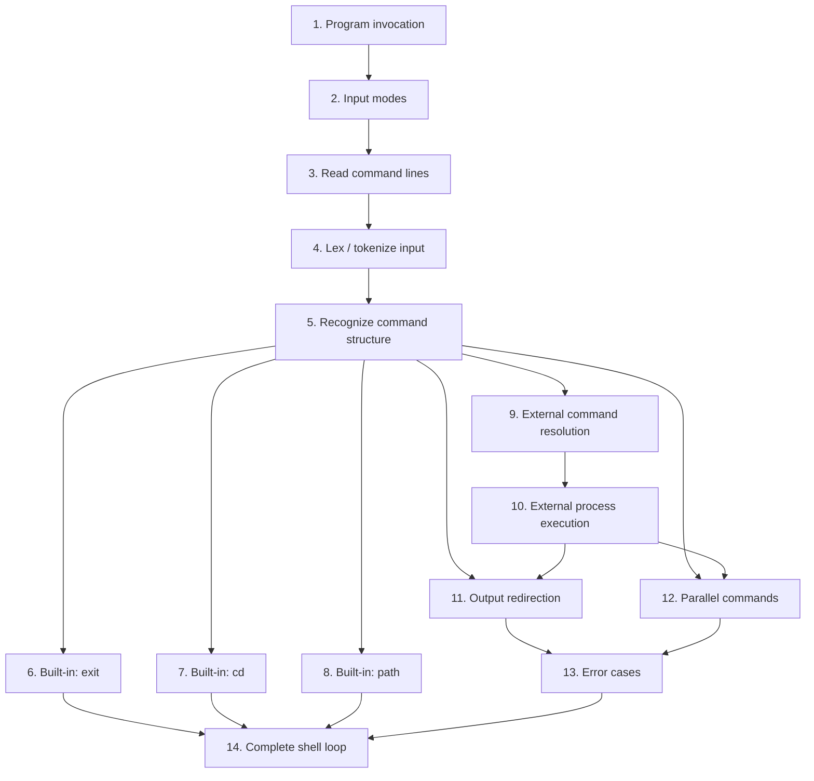
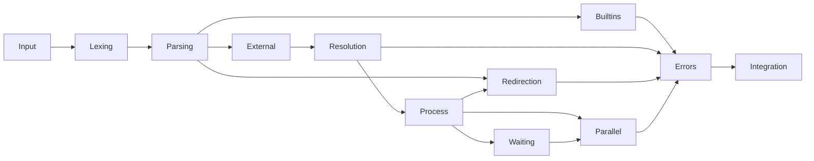

Yes — you want the **exercise itself decomposed into a dependency-ordered sequence of subproblems**, not a design/implementation architecture.

For the `wish` assignment, I’d linearize it like this:

### Exercise dependency order

But conceptually, the **actual exercise progression** is:

| #      | Subproblem                  | What you need to establish                                               |
| ------ | --------------------------- | ------------------------------------------------------------------------ |
| **1**  | **Invocation**              | `wish` accepts 0 or 1 argument; determine interactive vs batch           |
| **2**  | **Input**                   | Repeatedly obtain one line from the selected input source                |
| **3**  | **Lexical structure**       | Turn a line into commands, arguments, `>`, and `&`                       |
| **4**  | **Command structure**       | Determine where one command ends and another begins                      |
| **5**  | **Built-in `exit`**         | Recognize and terminate correctly                                        |
| **6**  | **Built-in `cd`**           | Modify the shell's working directory                                     |
| **7**  | **Built-in `path`**         | Maintain and replace the shell's executable search path                  |
| **8**  | **External command lookup** | Map a command name to an executable using the current path               |
| **9**  | **External execution**      | Create a process and execute the resolved program                        |
| **10** | **Waiting**                 | Establish parent/child completion semantics                              |
| **11** | **Redirection**             | Change the external process's stdout/stderr destination                  |
| **12** | **Parallel execution**      | Start multiple commands before waiting                                   |
| **13** | **Error semantics**         | Distinguish malformed shell input, builtin errors, lookup failures, etc. |
| **14** | **Integration**             | Put the above into the complete read → parse → execute → wait cycle      |

The important **dependency structure** is:

### The exercise in one formal pipeline

You can think of the whole assignment as progressively defining:

$$
\boxed{
\text{Invocation}
\to
\text{Input}
\to
\text{Syntax}
\to
\text{Command}
\to
\text{Execution}
\to
\text{Concurrency}
\to
\text{Error semantics}
}
$$

or, more formally,

$$
I
\xrightarrow{\text{lex}}
T
\xrightarrow{\text{parse}}
C
\xrightarrow{\text{classify}}
E
\xrightarrow{\text{execute}}
S'
$$

where:

* \(I\) = input lines
* \(T\) = tokens
* \(C\) = syntactically valid commands
* \(E\) = execution plans
* \(S'\) = resulting shell/process state

And each new feature extends the preceding semantic layer rather than being an independent implementation task.

So if you're **doing the assignment as an exercise**, I'd actually solve it in this order:

**Invocation → input loop → parsing → `exit` → `cd` → `path` → external execution → waiting → redirection → parallelism → errors → integration.**

That gives you the cleanest incremental difficulty curve. 
