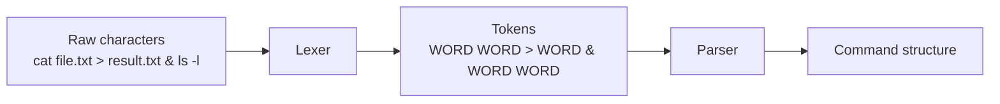

**Lexing** (or **lexical analysis**) is the step where you take a raw string of characters and turn it into a sequence of **tokens** that have meaning to the language/parser.

Think:

$$
\text{characters} \xrightarrow{\text{lexing}} \text{tokens}
$$

### Simple example

Suppose your shell receives:

```text
ls -la > output.txt
```

The raw input is just characters:

```text
l s   - l a   >   o u t p u t . t x t
```

The lexer recognizes meaningful units:

```text
[
  WORD("ls"),
  WORD("-la"),
  REDIRECT(">"),
  WORD("output.txt")
]
```

The important distinction is:

* **Lexing asks:** *What are the pieces?*
* **Parsing asks:** *How do those pieces fit together?*

---

### For your `wish` exercise

Your shell has three particularly important lexical categories:

$$
Token =
\underbrace{Word}_{\text{command/argument}}
\mid
\underbrace{>}_{\text{redirection}}
\mid
\underbrace{\&}_{\text{parallelism}}
$$

For example:

```text
cat file.txt > result.txt & ls -l
```

could lex into:

```text
WORD("cat")
WORD("file.txt")
REDIRECT(">")
WORD("result.txt")
AMPERSAND("&")
WORD("ls")
WORD("-l")
```

Notice something important:

```text
cat file.txt>result.txt&ls
```

should produce **the same tokens**:

```text
WORD("cat")
WORD("file.txt")
REDIRECT(">")
WORD("result.txt")
AMPERSAND("&")
WORD("ls")
```

because `>` and `&` are operators even when there is no whitespace around them.

That's why lexing is useful: it removes irrelevant details like *where the spaces were* and gives the parser a cleaner mathematical object.

### Then parsing happens

The parser takes those tokens and determines their structure:

```text
cat file.txt > result.txt & ls -l
```

becomes something conceptually like:

$$
\text{Parallel}
[
  \text{Command}(
    \text{argv}=[cat,file.txt],
    \text{redirect}=result.txt
  ),
  \text{Command}(
    \text{argv}=[ls,-l]
  )
]
$$

So your pipeline is:



A useful way to remember it:

> **Lexer = vocabulary. Parser = grammar.**

The lexer identifies **what things are**; the parser determines **how those things are arranged**.
